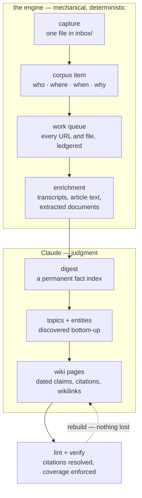
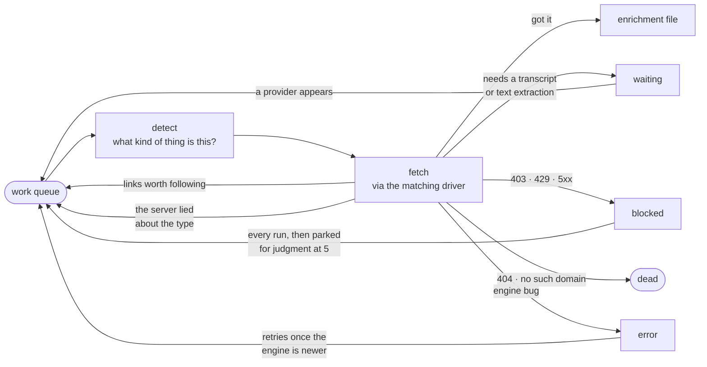

<div align="center">

# 🧠 dex

**Your own knowledge base, maintained for you by Claude.**

Save things with one tap. Ask questions later. Everything cited, dated, and kept current.

[](https://claude.com)
[](https://github.com/leeovery/dex/blob/main/pyproject.toml)
[](https://docs.astral.sh/uv/)

</div>

---

You keep finding good things — videos, articles, papers, repos, threads. They pile
up in bookmarks and group chats and disappear. Six months later you remember that
someone said something important about a thing, and that's all you've got.

**dex** turns that stream into a living wiki. Every source is fetched and read in
full — captions pulled, audio transcribed, PDFs extracted, threads walked back to
their root. Every fact traces to where it came from. Every page stays current as
new material arrives, with the old understanding kept as marked history rather
than overwritten.

You don't run anything. Claude operates the whole system; your job is taste —
save things, ask questions, correct it when it's wrong. The design follows
Karpathy's [llm-wiki](https://gist.github.com/karpathy/442a6bf555914893e9891c11519de94f)
pattern: *"The human's job is to curate sources, direct the analysis, ask good
questions. The LLM's job is everything else."*

## What actually happens

You're on your phone. You share an X thread to dex and forget about it. That's
your entire involvement.

At the next run:

```
the thread          walked up to its root — every post, in reading order,
                    each one attributed, quoted posts inline

the repo in it      fetched: README, description, metadata

the paper it cites  fetched from arXiv

the talk it links   captions pulled. No captions? The audio is downloaded and
                    transcribed locally, primed with the video's own title and
                    description so the names and jargon come out right

all of it           filed as one corpus item, stamped with who shared it,
                    where, and when — captured once, at the only moment it
                    exists

then                a digest is written (a permanent fact index for the item),
                    topics and entities are placed, and the wiki pages that
                    care are rewritten — dated claims, citations back to the
                    item, [[wikilinks]] to related pages

finally             every citation is resolved and every item is accounted
                    for, mechanically, before the run is allowed to finish
```

Ask "what's the current thinking on X?" a month later and the answer comes from
those pages, newest material first, with citations you can follow back to the
thread you forgot you saved.

## Getting started

Setup is one paste, and Claude does the rest — new dex or joining one that
already exists, an interview about scope, install, phone capture.

Use **Claude Code in the [Claude desktop app](https://claude.com/download)**. It
is the only place that can also arm the schedule: a local routine that runs dex
on your own machine, with your GitHub auth and network.

1. Open the app → **Code** → new chat.
2. Set the model to **Opus-class** — the work is judgment, and lighter models
   degrade it invisibly.
3. Point the chat at your home or code folder. Setup asks where the dex should
   actually live and puts it there.
4. Paste this and press enter:

```
Fetch https://raw.githubusercontent.com/leeovery/dex/main/docs/start.md and follow it.
```

Then it's live: save things, and open a Claude Code session on the folder to
ask questions.

### Other ways in

- **A terminal.** Same paste, same install — it just can't arm the routine, so
  the trigger becomes yours: cron, launchd, or nothing at all. A schedule is a
  convenience, not a requirement; captures wait in the inbox until something
  runs, and nothing expires.
- **Another agent.** dex isn't Claude-specific — anything that reads skills
  should be able to drive it. Untested, so treat it as an experiment.
- **Yourself.** [docs/start.md](docs/start.md) is the procedure itself. Read it
  and follow it by hand.

## Living with it

**Save from anywhere.** Capture is a protocol, not an app — one markdown file
landing in the instance's `inbox/`, and anything that can make an HTTPS request
can implement it ([`docs/capture.md`](docs/capture.md)). Today that means:

- the **phone shortcut** — share from any app, one tap ([`docs/shortcut.md`](docs/shortcut.md))
- **any Claude session** — "add this to dex", and it's committed and pushed
- **chat exports** dropped in for backfill

Capture and processing are deliberately separate. Saving is instant and always
succeeds; the work happens later. A capture that carried a photo or a PDF stages
the binary out of band, so git history stays text-only.

**Ask anything.** Open a session on the folder. Answers come from the wiki with
citations, newest material preferred, and genuinely new syntheses get filed back
in so they compound instead of evaporating.

**It corrects itself.** Health checks run on their own when the last one is more
than a week old. Corrections you make by hand are pinned and survive every
rebuild.

One **dex**, many brains: each knowledge base is its own private *instance* repo
(dex-cooking, dex-woodworking, one for your partner's business...) and this public
repo is the shared engine they all run on.

## How it works

Two kinds of work, kept strictly apart. The engine fetches, moves, and verifies —
deterministically, no judgment. Claude reads, decides, and writes.



The corpus is the truth. The wiki is a build artifact: pages can be regenerated
from scratch without losing anything, which is what makes rewriting them safe.

### The work queue

Everything fetchable becomes an entry in an append-only ledger, and a run drains
whatever isn't finished. Nothing is fire-and-forget, and nothing quietly vanishes:



**Blocked is never dead.** A Cloudflare challenge, a rate limit, a bad gateway —
the world misbehaving is not the same as the thing being gone, and only a real
404 or a domain that doesn't resolve is final. A fetch that returns 200 but comes
back empty parks for judgment too: that means *our tooling couldn't read it*, not
that there was nothing there.

## What it can read

| source | what it does |
|---|---|
| **YouTube** | captions where they exist; otherwise the audio is downloaded and transcribed |
| **X** | walks the thread up to its root — every post in reading order, each attributed, quoted posts inline. Sharing a thread's *last* post rolls up the whole thing. An incomplete chain is recorded as incomplete, never presented as whole |
| **GitHub** | repos and profiles — README, description, metadata |
| **Papers** | arXiv and friends |
| **Podcasts** | an Apple or Spotify link resolves to the show's RSS and the actual audio enclosure, then transcribes it — show notes come from the feed, which is richer than the page |
| **Web** | article text with the boilerplate stripped, Wayback fallback when the live page has gone |
| **Files** | PDF, Word, PowerPoint, Excel, OpenDocument, RTF, EPUB, CSV — text extracted, embedded images pulled out alongside it. Scanned pages route to OCR |

Three things happen on top of that, which is where most of the value is:

- **Links get followed with judgment.** At every fetched page, Claude decides
  which links are primary artifacts of the thing itself — the project's repo, the
  paper, the docs — and promotes those. Blogrolls, footers and "similar projects"
  never get promoted, at any depth. The engine bounds the judgment mechanically
  (4 levels deep, 12 fetched URLs per item) rather than trying to make it.
- **Transcription has a free floor.** Local whisper is the default and needs no
  API key, no GPU, and no account. Point it at any OpenAI-compatible endpoint if
  you'd rather have speed; long audio is chunked, so upload limits don't apply.
- **A source that lies gets corrected mid-fetch.** A URL that claims to be a web
  page and turns out to be a PDF is re-detected from its actual bytes and
  re-routed, in the same run, in either direction.

## It looks after itself

- **Failed work retries on its own.** Blocked fetches every run. Engine bugs
  once the engine is newer — no point retrying a deterministic bug on the same
  code.
- **It reports its own bugs.** An engine exception files an issue at this repo,
  deduplicated by fingerprint. Issue bodies carry no free text at all — version,
  command, error class, an engine-frames-only traceback, a URL *hash*. Not a
  scrubber that might miss something: the field simply doesn't exist, so your
  content has nowhere to leak through.
- **Fixes arrive by themselves.** Instances pin an engine release. Sync checks
  for a newer one, bumps the pin, runs any state migrations, and refreshes the
  synced machinery — before anything touches state, at the start of every run.
  The loop closes: bug files issue → fix → release → sync → the failed work
  retries and succeeds.
- **The wiki is checked mechanically.** Broken wikilinks, citations that don't
  resolve to a real corpus item, uncited orphans, index drift, pages older than
  their own sources, restated facts, ledger schema violations. Judgment repairs
  what the check finds.
- **Health checks trigger themselves** when the last one is over a week old, and
  the corrections you pin by hand are re-applied after every rebuild.

## On the way

- **Watchers** — folders, Dropboxes, RSS and social feeds as standing capture
  sources feeding the same inbox. Designed next.
- **Instagram** — no clean API exists; the approach isn't settled.
- **Hosted transcription** — any OpenAI-compatible provider already works; a
  benchmarked, recommended config is still to come.

Tracked in [`design/roadmap.md`](design/roadmap.md).

---

See [`example/`](example/) for a toy instance showing the shapes, and
[`instance/skills/dex-run/references/schema.md`](instance/skills/dex-run/references/schema.md)
for the corpus format.

<details>
<summary><b>Under the hood</b> (for agents and the curious — humans never need this)</summary>

Instances run the engine's mechanical commands via a `bin/dex` shim
(`uvx --from git+https://github.com/leeovery/dex@<pinned-tag> dex-<cmd>`,
cwd = instance root; the tag lives in `.dex-engine-pin`, bumped by sync):

| command | does |
|---|---|
| `dex-enrich run` | drain the ledger work queue: fetch behind every corpus URL and file — captions, articles (Wayback fallback), GitHub, papers, X thread walk-up, podcast audio → transcript, document extraction — and report the session's cognitive work list |
| `dex-enrich status` | ledger summary, waiting cohorts, interrupted-session backstop, capability report (`--item <id>` for one item's ledger view) |
| `dex-enrich transcribe` | drain the waiting transcription cohort (whisper local floor / OpenAI-compatible API; `--limit`, `--model`) |
| `dex-enrich fetch` | fetch extra URLs into an existing item, ledgered as children (the harvest verb) |
| `dex-enrich compact` | rewrite the ledger to the latest line per unit (settles union merges) |
| `dex-enrich mark` | heal one ledger entry — the sanctioned correction verb |
| `dex-enrich pass` | record a stage completion (harvest/digest/wiki) in `state/passes.jsonl` |
| `dex-enrich item new` | create a corpus item from a capture file (id rules + provenance; code writes frontmatter) |
| `dex-normalize` | raw chat exports → corpus items (DiscordChatExporter JSON) |
| `dex-lint` | mechanical health check: wikilinks, citations (shortid flags included), orphans, index drift, stale pages, count drift, restated-fact warnings, ledger schema, quarantine, pass records (`--write` reconciles derived wiki frontmatter) |
| `dex-exclude <json>` | permanently purge out-of-scope items (survives re-normalization) |
| `dex-inbox` | materialize staged binary captures: release asset → `media/<id>/` (LFS), asset deleted (`ensure` creates the standing inbox release) |
| `dex-sync` | pin check + engine upgrade, migrations, machinery refresh, sync report — step 0 of every run |
| `dex-render` | render a named report surface from a JSON payload, verbatim (skills never hand-draw tables) |
| `dex-new <name>` | scaffold a new instance from the engine's bundled template |

The pipeline is ledger-driven (`state/enrichment-ledger.jsonl` is the work
queue, append-only, last-line-per-unit): drivers per source shape, one
central failure classifier (blocked ≠ dead, ever), capabilities with a free
local floor (faster-whisper transcription; document extraction), and an
issue filer that reports engine bugs upstream — sanitized by construction —
so every instance heals through releases and sync.

Every run completes end-to-end inside one Claude session: the run report is
the session's work list, and the same session finishes the cognitive steps for
everything on it. There is no headless daemon and no handoff. Entries that
survive a session are `waiting`, `blocked`, `error` or `manual` — each parked
for a stated reason, each printed on the report.

Capture inbox: every capture is one `.md` in `inbox/`, written via the
GitHub contents API (the phone shortcut) or committed directly by the
dex-capture skill — body = URL and/or note; a capture that carried a binary
(image, PDF, any file) stages it as an asset on the repo's standing `inbox`
release and references it in frontmatter. No server-side machinery at all: the
PUT is the commit, and the next run moves staged binaries into `media/` where
LFS applies. Suggestion is untrusted by design — scope filtering happens at
processing time, inside the instance. Full protocol: `docs/capture.md`.

Instance layout: `CLAUDE.md` (scope + operations contract) · `inbox/` (pending
captures) · `raw/` (verbatim exports) · `corpus/` (append-only items) ·
`enrichment/` · `media/` (captured binaries, LFS) · `wiki/`
(topics/entities/syntheses plus index, log, pins) · `state/` (digests,
taxonomy, the ledger and other append-only JSONL, config.json) · `cache/`
(gitignored ephemera) · `.dex-engine-pin` (the engine release this instance
runs).

</details>
